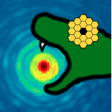

##############
SpaceKLIP 🚀🪐
##############

SpaceKLIP is a data reduction pipeline for JWST high-contrast imaging. The current release has been tested with NIRCam and MIRI coronagraphy data.

Compatible test data: `here <https://stsci.box.com/s/0oteh8smujl3pup07hyut6hr4ag1i2el>`_ 

Documentation: `here <https://spaceklip.readthedocs.io/en/latest/>`_

Installation
************

At this stage it is recommended that you clone the Git repository directory for installation:

::

	git clone https://github.com/kammerje/spaceKLIP.git

If you would like to install a specific branch:

::

	git clone https://github.com/kammerje/spaceKLIP.git@branch

From here, it is **highly** recommended that you create a unique Anaconda environment to hold all of the spaceKLIP dependencies:

::

	conda create -n spaceklip python=3.11
	conda activate spaceklip

With the Anaconda environment created, move to the cloned directory and install the dependencies and spaceKLIP itself:

::

	cd where/you/saved/the/git/repo
	conda install conda-forge::git-lfs	
	pip install -r requirements.txt
	pip install -e .

Note that installing git-lfs from pip does not work as of 25 June 2024.

Finally, and very importantly, you will need to download the reference files and set the environment variables supporting the functioning of :code:`webbpsf` and :code:`webbpsf_ext`. Instructions to do this can be found at the respective package websites (`WebbPSF <https://webbpsf.readthedocs.io/en/latest/installation.html#installing-the-required-data-files>`_, `WebbPSF_ext <https://github.com/JarronL/webbpsf_ext>`_). Ensure that if you edit your .bashrc file, close and reopen your terminal to fully apply the changes (:code:`source ~/.bashrc` or :code:`source ~/.zshrc` may also work).

SpaceKLIP also makes use of the JWST Calibration Reference Data System (CRDS) and you will need to set the corresponding environment variables. Follow the instructions here for bash or zsh: https://jwst-crds.stsci.edu/docs/cmdline_bestrefs/. Note that you do not have to install AstroConda, just set the environment variables (making sure that the CRDS path you set actually exists, i.e., you may need to create the directory).

Code status
***********

The current capabilities of the code are summarized below.

::

	database.py

- ``read_jwst_s012_data``: working
- ``read_jwst_s3_data``: working
- ``read_jwst_s4_data``: working
- ``print_obs``: working
- ``print_red``: working
- ``print_src``: working
- ``update_obs``: working
- ``update_src``: working
- ``summarize``: working

::

	plotting.py

- ``display_coron_image``: working
- ``display_coron_dataset``: working

::

	utils.py

- ``read_obs``: working
- ``write_obs``: working
- ``read_red``: working

::

	coron1pipeline.py

- ``run_obs``: working
- custom saturation step: working
- custom reference pixel step: needs updating (side reference pixels not working for subarrays)

::

	coron2pipeline.py

- ``run_obs``: working
- additional outlier detection step: working

::

	coron3pipeline.py

- ``make_asn_file``: working
- ``run_obs``: working

::

	pyklippipeline.py

- ``run_obs``: working
- no absolute PSF alignment, this is now done using the ``ImageTools`` library
- no relative frame alignment, this is now done using the ``ImageTools`` library
- the old ``JWST.py`` is now implemented here
- save individual rolls with ``save_rolls = True`` keyword

::

	classpsfsubpipeline.py

- ``run_obs``: working, under development
- save individual rolls with ``save_rolls = True`` keyword

::

	imagetools.py

- ``remove_frames``: working
- ``crop_frames``: working
- ``pad_frames``: working
- ``coadd_frames``: working
- ``subtract_median``: working
- ``subtract_background``: working
- ``fix_bad_pixels``: working
- ``replace_nans``: working
- ``blur_frames``: working
- ``update_nircam_centers``: working with filter-dependent shifts
- ``recenter_frames``: working (absolute PSF alignment)
- ``align_frames``: working (relative frame alignment)

::

	analysistools.py

- ``raw_contrast``: working with ``pyklippipeline`` products, not working with ``coron3pipeline`` products since PSF center not being tracked
- ``extract_companions``: working with ``pyklippipeline`` products, not working with ``coron3pipeline`` products since PSF center not being tracked
- combined coronagraphic throughput map: working
- `` calibrated_contrast`` working with ``pyklippipeline`` products

::

	mast.py

- ``query_coron_datasets``: working
